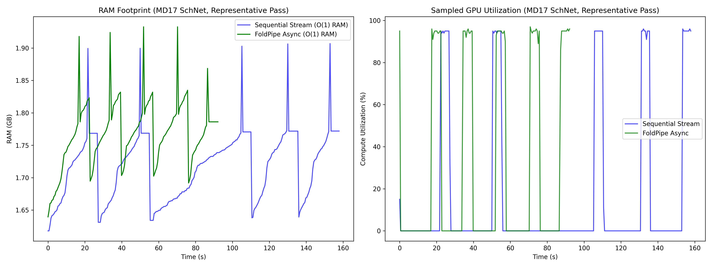

# FoldPipe: Bounded-Memory Streaming of Native Molecular-Graph Shards

[](https://pypi.org/project/foldpipe/)
[](https://github.com/aviatorlf/FoldPipe/actions)

> [!WARNING]
> **Security: trusted data only.**
> FoldPipe deserializes PyTorch/PyG objects with `torch.load(weights_only=False)`.
> Only stream `.pt` shards from sources you trust.
> Loading an untrusted pickle-based PyTorch object may execute arbitrary code.

## The Problem

Standard Machine Learning Force Field (MLFF) pipelines often bottleneck at the CPU data loader. When large molecular trajectories do not fit in memory, eager or in-memory representations can exhaust RAM and leave accelerators waiting on data, especially on constrained instances such as Kaggle T4 runners.

## The Solution

**FoldPipe** is a domain-specific integration of bounded-buffer asynchronous prefetching tailored for native `.pt` molecular trajectories. It bridges the gap between PyG's in-memory/on-disk abstractions and format-converting streaming systems such as WebDataset, particularly for memory-constrained ephemeral compute.

FoldPipe provides an out-of-core orchestration layer for datasets that exceed local memory constraints. A single background prefetch worker overlaps retrieval of shard *N+1* with training on shard *N*, while a bounded shard lifecycle keeps the working set independent of total dataset size.

## Honest Positioning & Prior Art

To be 100% factual, transparent, and defensible in peer review, here is how FoldPipe positions itself against the prior art:

*   **"We do not replace LMDB for local high-performance computing clusters."** Existing out-of-core streaming systems like WebDataset and LMDB provide petascale throughput. However, they require researchers to convert their native PyTorch/PyG outputs into POSIX `.tar` archives or binary databases. FoldPipe sacrifices absolute peak cluster throughput to eliminate this conversion step, allowing researchers to train directly on native `.pt` shards.
*   **"We extend the PyTorch Geometric ecosystem."** PyG's `InMemoryDataset` provides excellent throughput for datasets that fit in RAM. PyG's `OnDiskDataset` uses a database backend (SQLite/RocksDB) for datasets that don't. FoldPipe provides an outer orchestration layer for remote, already-sharded `.pt` files, with bounded working-set memory independent of total shard count.

The utilization measurements belong to different experiments and should not be conflated:

| Experiment | Workload | FoldPipe mean GPU utilization | Interpretation |
| :--- | :--- | ---: | :--- |
| Exploratory controlled crossover | Deliberately deep synthetic compute | >90% in the compute-dominant regime | Demonstrates that prefetch *can* mask I/O when compute time is long enough. Exploratory; not the rigorous paired benchmark. |
| Real MD17 benchmark (20 pairs) | SchNet energy-and-force training, 20 paired order-alternating passes | 37.70% | Real-workload mean across FoldPipe passes. Speed advantage is statistically inconclusive. |

## Empirical Benchmarks

### Controlled Crossover (Exploratory)

To evaluate when asynchronous prefetch masks network I/O, we swept synthetic compute depth against fixed network latency. In the compute-dominant regime, sampled GPU utilization exceeded 90%, confirming that the overlap mechanism works as designed. This exploratory result characterizes the mechanism; it is not the MD17 SchNet utilization result.

### Kaggle T4 MD17 Benchmark (Rigorous, 20 Pairs)

The rigorous benchmark completed 20 paired, order-alternating measurements of a real SchNet energy-and-force workload streaming revision-pinned MD17 shards from Hugging Face. Each timed measurement is a **5-shard benchmark pass** (5,000 structures per shard, 25,000 structures per pass).

| Metric | Sequential | FoldPipe |
| :--- | ---: | ---: |
| Mean pass time | 83.37 s | 76.78 s |
| Median pass time | 75.27 s | 75.97 s |
| Time standard deviation | 39.86 s | 28.46 s |
| Mean sampled GPU utilization | 36.17% | 37.70% |
| Mean peak RSS | 1.935 GiB | 2.064 GiB |
| Mean I/O–compute overlap | 0.00 s | 16.33 s |
| Mean GPU wait time | 56.50 s | 48.65 s |

FoldPipe was faster in 11 of 20 pairs. The geometric mean paired speedup was 1.059× with a 95% bootstrap interval of 0.878×–1.288×. All confidence intervals include their respective no-effect values, so this experiment demonstrates operation of the overlap mechanism but is **inconclusive about a wall-clock speed advantage** under the observed public-network variability.

The benchmark pinned `aviatorlf/md17-shards` to revision `f779686deb9217877dd7ddde99b2522bd441492a`. The current software release is FoldPipe 0.3.2; the MD17 measurements analyzed in the paper are preserved in the frozen v0.3.0 research artifact.



Artifacts: [`benchmark report`](results/benchmark_report_md17.md), [`raw statistics and traces`](results/benchmark_stats_md17.json).

## Quickstart & Usage

### 1. Installation

Install directly from PyPI (recommended):
```bash
pip install foldpipe==0.3.2
```

### 2. Standard PyTorch Training Loop

FoldPipe operates as a drop-in iterator. It handles the background threading and bounded-memory shard lifecycle automatically.

```python
from foldpipe import AsyncFoldPipeLoader
from foldpipe.sources import HuggingFaceSource

# Stream from HuggingFace (zero disk caching)
source = HuggingFaceSource(
    repo_id="username/my-dataset",
    pattern=".pt",  # match any .pt shard
    timeout=(10, 120),
    retries=3,
)

loader = AsyncFoldPipeLoader(source=source, batch_size=128)

model = MyEquivariantNetwork().to('cuda')
optimizer = torch.optim.Adam(model.parameters(), lr=0.001)

# Training loop — shard N+1 is fetched while GPU computes on shard N
for batch in loader:
    optimizer.zero_grad()
    out = model(batch.to('cuda', non_blocking=True))
    loss = criterion(out)
    loss.backward()
    optimizer.step()
```

## Data

FoldPipe does not bundle or automatically download the benchmark dataset. The published MD17 benchmark used pre-generated PyG shards derived from MD17 aspirin data. See `scripts/` and `results/` for benchmark provenance. The `data/prion/` files are tutorial assets only.

## License

MIT
